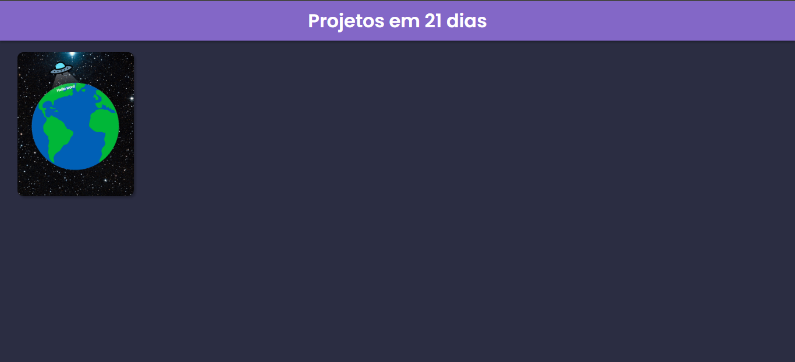

<h1 align="center">21 Projetos em 21 dias</h1>

## 📋 Sobre

O objetivo é escrever 21 projetos em 21 dias, com cada projeto explorando uma funcionalidade nova em html ou css, com a finalinade de refinar minhas habilidades e criatividade.

<h2 align="center">
    <a>Acesse o site</a>
</h2>

---

# 💻 Tecnologias ultilizadas
- [React](https://pt-br.reactjs.org/)
- [TypeScript](https://www.typescriptlang.org/)
- CSS
- [ReactRouter](https://reactrouter.com/en/main)

 

---

# 🚫 Regras 

- Codar pelo menos uma vez ao dia
- Compartilhar todos os dias do meu progresso

 

---

## 💎 Dia 1 - Criar um repositório

- Criar o repositório deste projeto

<a href="https://www.linkedin.com/posts/%C3%A9rick-henrique-26a87b1b4_github-erickhenri21-days-projects-o-objetivos-activity-6986016532199825409-FzjG?utm_source=share&utm_medium=member_desktop">
    Link do post no Linkedin
</a>

 

---

## 💎 Dia 2 - Hello World

- Criar um Hello World customizado com fontes, cores e imagens

<a href="#">Link do post no Linkedin</a>

<a href="https://21-days-projects-jiqv.vercel.app/HelloWord">Link do site</a>

 

---